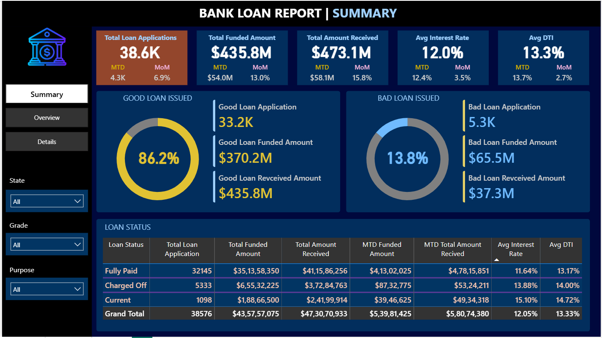
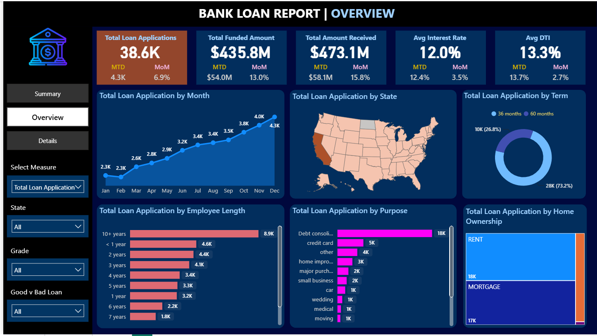
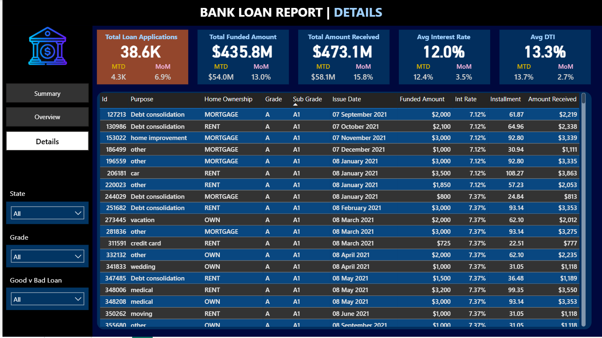

# 🏦 Bank Loan Analysis

> **Bank Loan Analysis using MySQL and Power BI**

## 📌 Project Overview

This project focuses on analyzing bank loan data to understand loan applications, funded amounts, repayments, interest rates, borrower risk, and loan performance.

The analysis was performed using **MySQL** for data analysis and **Power BI** for creating interactive dashboards.

## 🎯 Objectives

- Analyze total loan applications and funded amounts
- Understand loan repayment and amount received
- Compare Good Loans vs Bad Loans
- Analyze interest rate and DTI
- Identify monthly loan trends
- Analyze loans by state, purpose, grade, term, employee length, and home ownership
- Create interactive Power BI dashboards

## 🛠️ Tools & Technologies

- **MySQL**
- **Power BI**
- **Microsoft Excel**
- **CSV**

## 📊 Key Performance Indicators (KPIs)

- **Total Loan Applications:** 38.6K
- **Total Funded Amount:** 435.8M
- **Total Amount Received:** 473.1M
- **Average Interest Rate:** 12.05%
- **Average DTI:** 13.33%
- **Good Loan:** 86.18%
- **Bad Loan:** 13.82%

## 📈 Power BI Dashboard

### 🏠 Dashboard 1 – Summary

### 📊 Dashboard 2 – Overview

### 📋 Dashboard 3 – Details

## 🗄️ SQL Analysis

MySQL was used to analyze the bank loan dataset, including:

- Total Loan Applications
- MTD & PMTD Loan Applications
- Total Funded Amount
- Total Amount Received
- Average Interest Rate
- Average DTI
- Good Loan Analysis
- Bad Loan Analysis
- Loan Status Analysis
- Monthly Trends
- State Analysis
- Loan Term Analysis
- Employee Length Analysis
- Loan Purpose Analysis
- Home Ownership Analysis
- Grade Analysis

## 💡 Key Insights

The analysis helps understand loan performance, borrower characteristics, loan status, repayment trends, and the distribution of Good Loans and Bad Loans.

